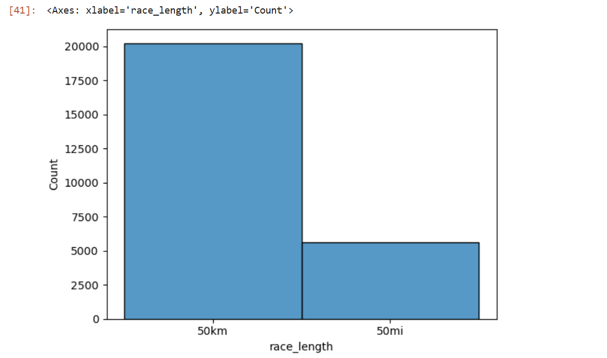
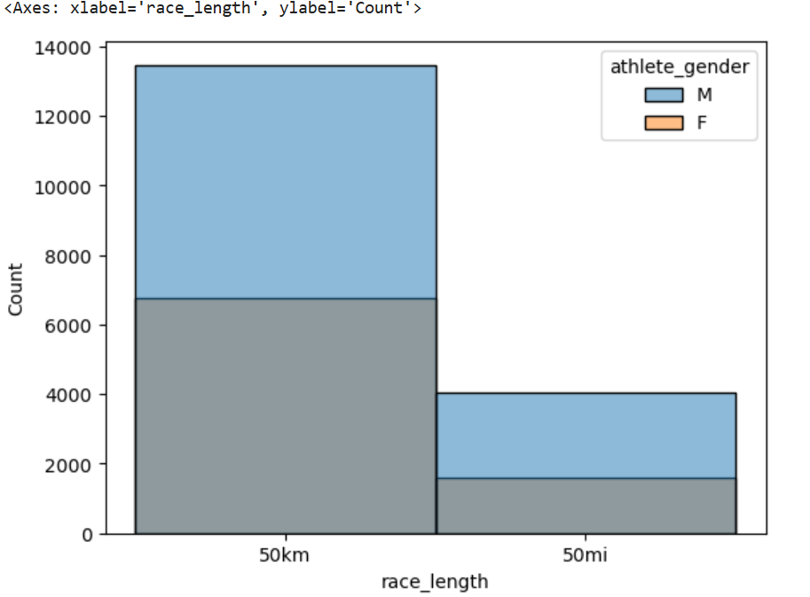
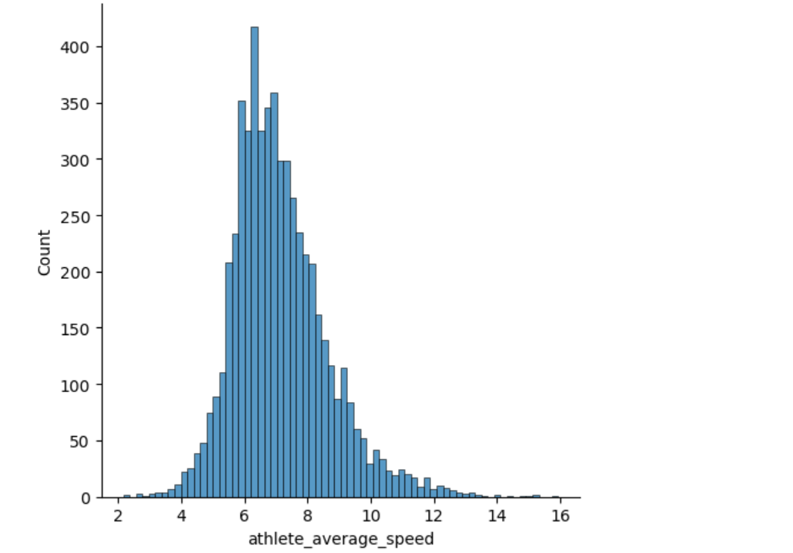
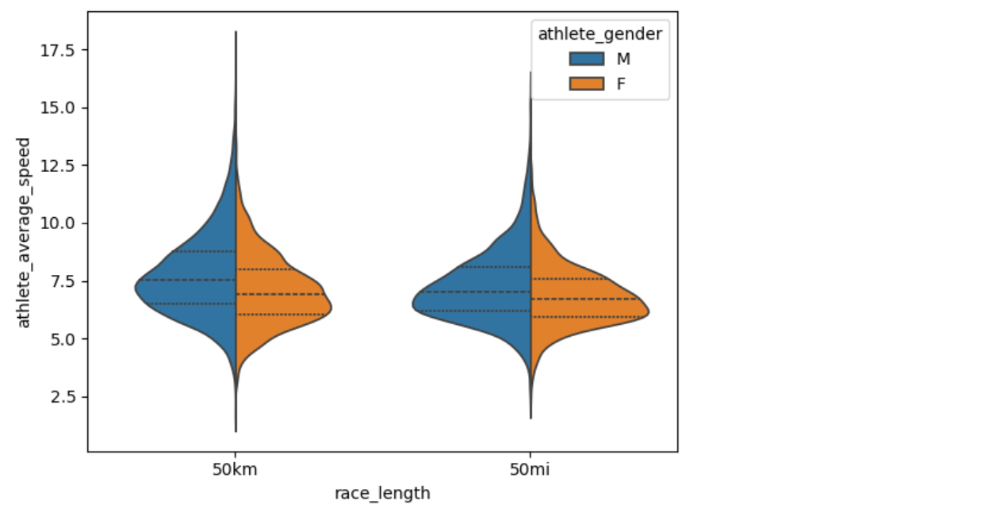
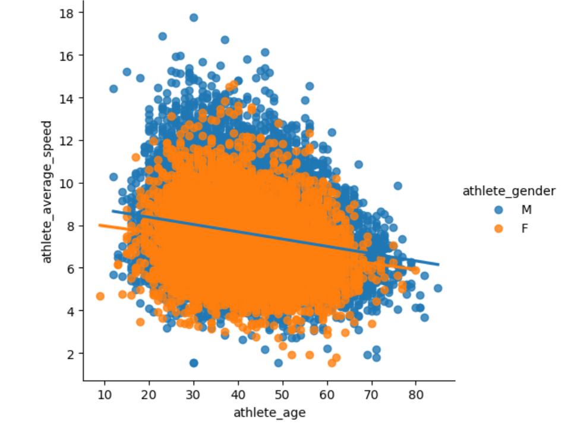

**Race Marathon Data**

**Overview**

This project analyzes a dataset called Two centuries of races, sourced from https://www.kaggle.com/datasets/fatihyavuzz/two-centuries-of-um-races.It contains information on long-distance running events held in various countries, including event dates, names, participant counts, athlete performance times, age categories, speeds, and birth years. It provides insights into the demographic and performance characteristics of urban marathons over two centuries.This project aims to explore trends and patterns in marathon data.

**Data Cleaning Process**

1.	**Data Subsetting**:

•	Filtered the data to include only USA races with distances of 50 kilometers or 50 miles in the year 2020.
•	Combined the 50km and 50mi data for consistency.
•	Further narrowed the data to include only races with the event name Everglades 50 Mile Ultra Run (USA) and removed "(USA)" from the event name for clarity.

3.	**Variable Naming**:
•	Used descriptive variable names such as usa_events, filtered_df, and everglades_event for better readability.

4.	**Processing Improvements**:
•	Operations were performed step-by-step to simplify debugging and understanding.
•	Created a new DataFrame (df2) using. copy() to avoid modifying the original data.
•	Limited the use of chained operations to enhance code readability.

5.	**Data Cleaning Steps**:
•	Removed the trailing "h" from athlete performance values.
•	Dropped unnecessary columns, including Athlete club, Athlete country, Athlete year of birth, and Athlete age category.
•	Handled 233 null values by dropping them, leaving a dataset with 25,857 rows and 10 columns.
•	Checked for and removed duplicate values.
•	Fixed data types and standardized column names by replacing spaces with underscores.

6.	**Final Adjustments**:
•	Reordered the columns for logical organization and easier analysis.

**Exploratory Data Analysis (EDA)**

Race Length and Gender Analysis:

Created a histogram to visualize the distribution of race lengths of 50 kilometeres and 50 miles to see which one had the most runs as shown below the count is higher for 50 kilometeres than 50 miles by a count of slighlty greater than 20,000 people as compared to 5500 people in 50 miles.

Analyzed using a histogram the race lengths based on athletes' gender as shown below.There are equal proportions of males and females who run the 50 kilometere race but the male proportion is slightly higher for males than females for the 50 mile race.

Plotted a distribution plot for race length and average speed as shown below. There is a normal distribution of the average speed of atheletes and it is slightly skewed to the right.

Plotted a violin plot to examine the relationship between race length and average speed by gender.

Plotted a scatter plot to examine the average speed against the age and based on gender.As shown below the average speed decreases as age increases.The decrease in speed is slighter higher in females than in males.

**Gender-Based Speed Differences**:

For 50km races, the average speed was:
Females: 7.083 km/h
Males: 7.739 km/h
For 50-mile races, the average speed was:
Females: 6.834 km/h
Males: 7.258 km/h

**Age and Performance**:
Determined the best-performing age group for 50-mile races:
Athletes aged 29 years had the highest average speed of 7.902 km/h.
Identified the worst-performing age groups for 50-mile races:
Athletes aged 55 to 70 and above had the lowest average speed of 5.471 km/h.
Seasonal Performance Trends:

**Analyzed the impact of weather seasons on performance**:
Found that in general, speeds were slower in summer compared to winter.
For all races, spring had the highest average speed of 7.684 km/h, with a participation count of 3,294.
For 50-mile races, fall in the year 1997 recorded the highest average speed of 7.512 km/h.

For 50km races, the average speed was:
Females: 7.083 km/h
Males: 7.739 km/h
For 50-mile races, the average speed was:
Females: 6.834 km/h
Males: 7.258 km/h

**Age and Performance**:

Determined the best-performing age group for 50-mile races:
Athletes aged 29 years had the highest average speed of 7.902 km/h.
Identified the worst-performing age groups for 50-mile races:
Athletes aged 55 to 70 and above had the lowest average speed of 5.471 km/h.

**Seasonal Performance Trends**:

**Analyzed the impact of seasons on performance**:
Found that in general, speeds were slower in summer compared to winter.
For all races, spring had the highest average speed of 7.684 km/h, with a participation count of 3,294.
For 50-mile races, fall in the year 1997 recorded the highest average speed of 7.512 km/h.

