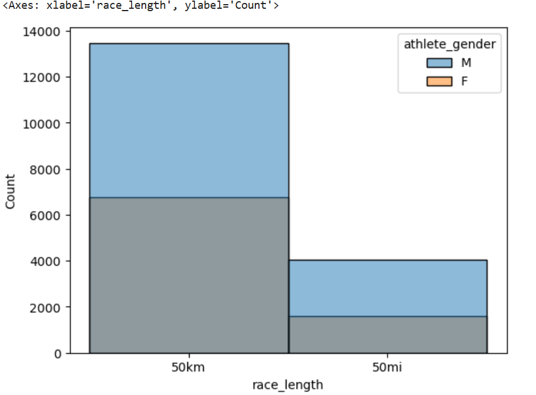
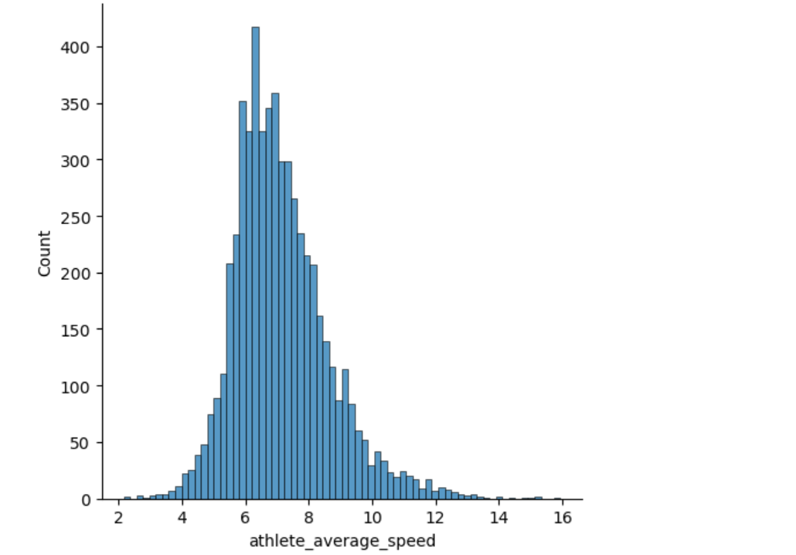
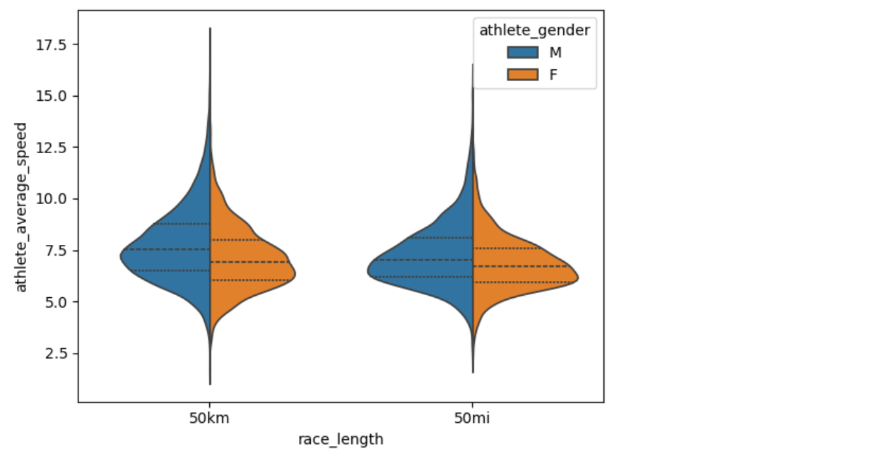
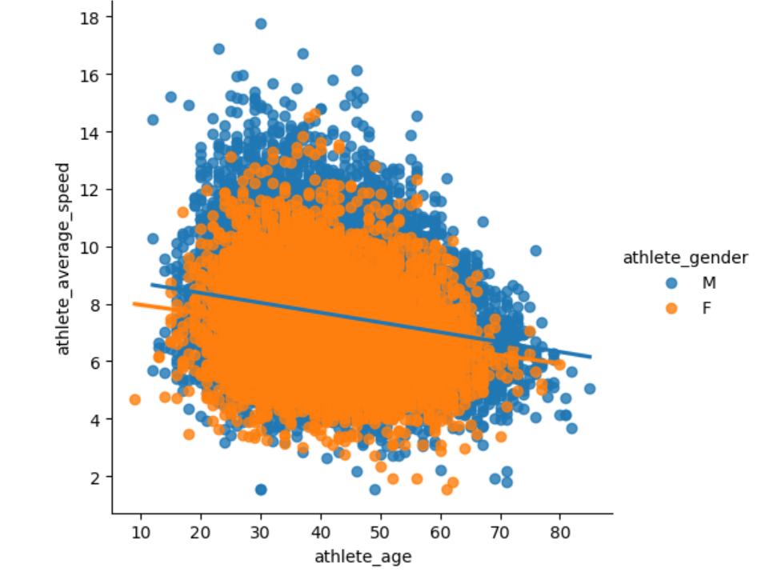

# Race Marathon Data 🏃‍♂️🏃‍♀️

## Overview 📊

This project analyzes a dataset called **Two Centuries of Races**, sourced from [Kaggle](https://www.kaggle.com/datasets/fatihyavuzz/two-centuries-of-um-races). The dataset contains information on long-distance running events held in various countries, including event dates, names, participant counts, athlete performance times, age categories, speeds, and birth years. This project explores trends and patterns in marathon data, specifically focusing on urban marathons over two centuries.

---

## Data Cleaning Process 🧹

### 1. **Data Subsetting** 🔍
- Filtered the dataset to include only **USA races** with distances of **50 kilometers** or **50 miles** in the year **2020**.
- Combined the 50 km and 50 mi data for consistency.
- Narrowed the dataset to include only the **Everglades 50 Mile Ultra Run (USA)** and removed "(USA)" from the event name for clarity.

### 2. **Variable Naming** 🏷️
- Used descriptive variable names like **usa_events**, **filtered_df**, and **everglades_event** for improved readability.

### 3. **Processing Improvements** ⚙️
- Simplified operations step-by-step to aid debugging and understanding.
- Created a new DataFrame (**df2**) using `.copy()` to preserve the original data.
- Limited chained operations to enhance code clarity.

### 4. **Data Cleaning Steps** 🧼
- Removed trailing **"h"** from athlete performance values.
- Dropped unnecessary columns such as **Athlete club**, **Athlete country**, **Athlete year of birth**, and **Athlete age category**.
- Handled **233 null values** by removing them, leaving 25,857 rows and 10 columns.
- Removed duplicate values and standardized column names by replacing spaces with underscores.

### 5. **Final Adjustments** 🔄
- Reordered the columns for logical organization and easier analysis.

---

## Exploratory Data Analysis (EDA) 📈

### Race Length and Gender Analysis 🏁

- **Histogram of Race Length Distribution**: Visualized the distribution of **50 kilometers** vs **50 miles** races. The 50 km race had a higher participation count (slightly greater than 20,000) compared to the 50-mile race (around 5,500 participants).

- **Gender Analysis by Race Length**: A histogram was plotted to analyze race lengths based on gender. For the **50 km race**, there was an equal distribution of male and female runners. However, for the **50-mile race**, males had a slightly higher proportion.

- **Race Length vs Average Speed**: A distribution plot revealed a normal distribution of athlete speeds, slightly skewed to the right, for both race lengths.

### Gender-Based Speed Differences 🚹🚺

- For the **50 km race**:
  - **Females**: Average speed = **7.083 km/h**
  - **Males**: Average speed = **7.739 km/h**
- For the **50-mile race**:
  - **Females**: Average speed = **6.834 km/h**
  - **Males**: Average speed = **7.258 km/h**

### Age and Performance 👶👵

- **Best-Performing Age Group**: Athletes aged **29 years** performed best in the **50-mile races**, with an average speed of **7.902 km/h**.
- **Worst-Performing Age Groups**: Athletes aged **55-70 years and above** had the lowest average speed of **5.471 km/h**.

- **Violin Plot of Race Length vs. Average Speed by Gender**: This plot examined the relationship between race length and average speed by gender.

- **Scatter Plot of Age vs Average Speed**: A scatter plot revealed that average speed decreases with age, with a more significant drop in females than males.

### Seasonal Performance Trends 🌦️

- **Impact of Weather Seasons on Performance**: Speeds were generally slower in **summer** compared to **winter**.
  - For all races, **spring** recorded the highest average speed of **7.684 km/h**, with **3,294 participants**.
  - For **50-mile races**, **fall 1997** had the highest average speed of **7.512 km/h**.

---

## Conclusion 🎯

This project provides insights into the performance patterns of marathon runners, focusing on factors like race length, gender, age, and seasonal variations. The analysis highlights key trends such as the average speed differences between genders and age groups, as well as the impact of seasonal changes on marathon performance.

---

Feel free to explore the full dataset and analysis to uncover more insights on marathon trends over the past two centuries! 📅🏅

---

